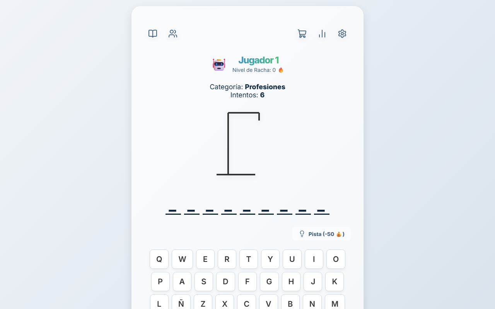
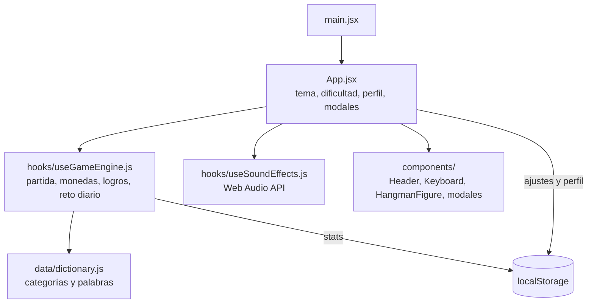

<div align="center">
  
  <h1>PalabraOculta</h1>
  <p><b>El ahorcado en español como app web: monedas, logros, reto diario y desafíos a amigos por enlace.</b></p>
  
  
  
  
  <a href="https://github.com/Luiss2080/PalabraOculta/actions/workflows/ci.yml"></a>
  
  <p>
    <a href="#-inicio-rápido">Inicio rápido</a> ·
    <a href="#-características">Características</a> ·
    <a href="#-arquitectura">Arquitectura</a> ·
    <a href="#-pruebas">Pruebas</a> ·
    <a href="#-lo-que-todavía-no-existe">Limitaciones</a>
  </p>
</div>

**PalabraOculta** es el clásico ahorcado reconstruido con React y Vite: teclado en pantalla y físico, tres dificultades, una economía de monedas con tienda y pistas, logros, reto diario y desafíos por enlace. Corre 100% en el navegador: **no hay backend, cuentas ni ranking en línea**; todo el progreso vive en el `localStorage` de tu navegador.

## 🎬 Vista rápida

<div align="center">
  
</div>

> Captura real de la build de producción servida en local (perfil por defecto "Jugador 1").

## ✨ Características

| Característica | Detalle |
| --- | --- |
| Dificultades | Fácil 8 intentos, Normal 6, Difícil 4; la recompensa por victoria es de 10, 20 o 30 monedas respectivamente. |
| Categorías | Frutas, Animales, Países y Profesiones; Películas (100 monedas) y Videojuegos (150) se desbloquean en la tienda. |
| Pistas | Revelan una letra a cambio de monedas (50 en la UI). |
| Logros | Primera Sangre, Impecable (sin fallos), Sobreviviente (ganar con un solo intento restante) y Millonario. |
| Rachas | Racha actual y las 5 mejores rachas guardadas. |
| Reto diario | Palabra elegida con una semilla derivada de la fecha UTC: la misma para todos ese día. |
| Reto a un amigo | Genera un enlace `?reto=` con la palabra en Base64 (ofuscación, **no** cifrado); se valida antes de usarse. |
| Interfaz | Tema claro/oscuro, color de acento, perfil local, parallax (`react-parallax-tilt`), partículas (`@tsparticles`), confeti y animaciones (`framer-motion`). |
| Sonido | Efectos generados con Web Audio API, con control de volumen. |
| Accesibilidad | Juego completo con teclado físico (incluida la Ñ) y foco atrapado en los modales. |

## 🏗️ Arquitectura



## 🚀 Inicio rápido

| Requisito | Versión |
| --- | --- |
| Node.js | 20 o superior (`engines` y CI usan 20) |
| npm | el que trae Node |

```bash
git clone https://github.com/Luiss2080/PalabraOculta.git
cd PalabraOculta
npm ci
npm run dev        # Vite, normalmente en http://localhost:5173
```

```bash
npm run build      # build de producción en dist/
npm run preview    # sirve la build en local
npm run lint       # oxlint
```

<details>
<summary>Estructura de carpetas</summary>

```text
src/
  App.jsx, main.jsx        # raíz de la app
  hooks/                   # useGameEngine, useSoundEffects, useFocusTrap
  components/              # Header, Keyboard, HangmanFigure, toasts, modales/
  data/dictionary.js       # palabras por categoría
  styles/                  # global.css, theme.css
  tests/                   # Vitest + React Testing Library
legacy/                    # versión original en HTML/CSS/JS puro (referencia, sin mantenimiento)
MANUAL.md                  # manual de usuario
.github/workflows/ci.yml   # lint + tests + build
```

</details>

## 🧪 Pruebas

**27 tests** en 3 archivos con [Vitest](https://vitest.dev/) y React Testing Library: motor del juego (`useGameEngine`), diccionario y `ChallengeModal`.

```bash
npm test
```

El workflow de CI (`.github/workflows/ci.yml`) ejecuta `npm ci`, lint, tests y build en cada push a `main` y en cada PR. Verificado localmente: tests 27/27, build correcto; `npm run lint` termina con 2 avisos (`set-state-in-effect`) y sin errores.

## 🔒 Seguridad y privacidad

- Sin backend ni envío de datos: nombre, avatar, monedas y ajustes se guardan solo en tu navegador.
- El parámetro `?reto=` se decodifica con validación (una cadena Base64 malformada no rompe la app).
- Como el reto viaja en Base64, cualquiera que lea el enlace puede ver la palabra.

## 🚧 Lo que todavía no existe

- Sin ranking global, cuentas ni sincronización entre dispositivos; borrar los datos del navegador borra el progreso.
- Diccionario chico (unas 7 a 9 palabras por categoría) y solo en español.
- En la tienda hay un "Tema: Neón (Próximamente)" que aún no está disponible.
- El paquete se llama `temp-app` en `package.json` (nombre provisional).
- `legacy/` es la versión antigua conservada como referencia; no se mantiene.
- 2 avisos de lint pendientes.

## 📄 Licencia

MIT, ver [`LICENSE`](LICENSE).

<div align="center"><sub>Hecho por Luiss2080 · Santa Cruz de la Sierra, Bolivia</sub></div>
